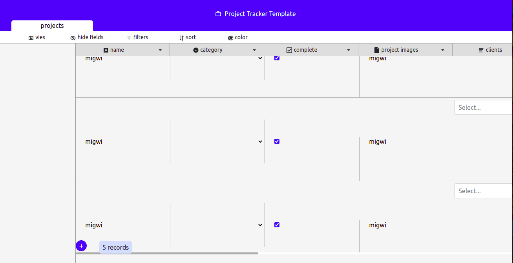
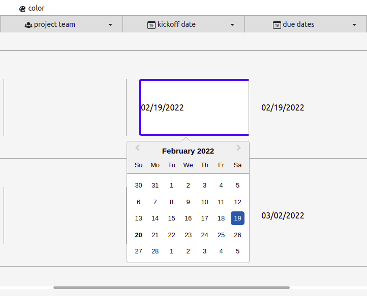
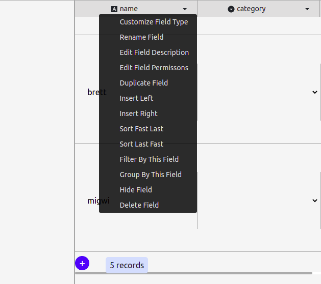
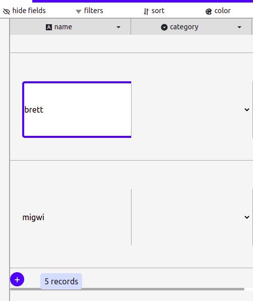

# React Airtable MVP Application

The Applications has Achieved the following challenges :
- Read data from the Airtable API
- Create new records of data
- Update the records
- It has a Date picker Mechanism
- The inputs of the App have followed the implementation design
- The fields have a drop down menu

# Tools Used
- `Reactjs -v 16.5`
- `Nextjs  -v `
- `Ubuntu  -v 21.10`
- `Vscode  -v `
- `Airtable API`
  
# others
- `SASS`
- `BOOTSTRAP V5`
- `React-icons`

## Different Components of the Applicatio
 
#### Date Picker
 

#### Category Select

####  field Drop downs

####  Name field

#### Add new Records
- Press the plus button at the button
- New input area will apply and fill in the 
- Press the Apply to make changes to your API

   
